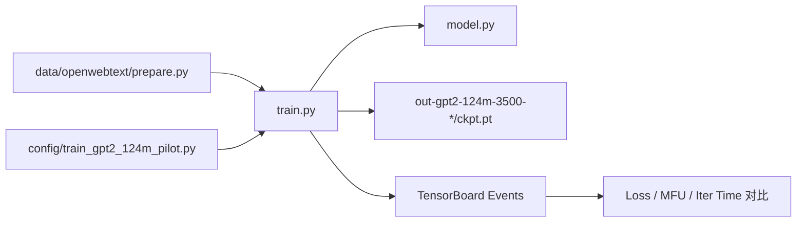
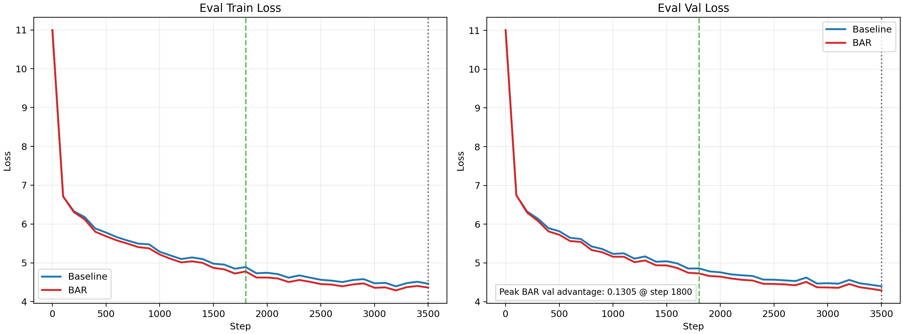
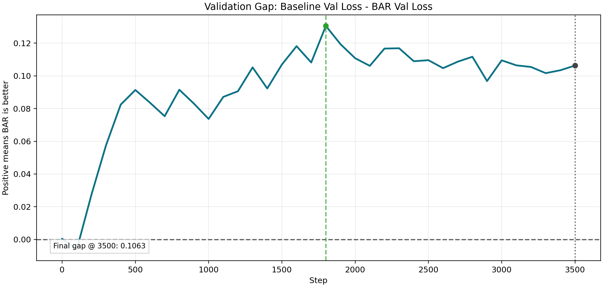
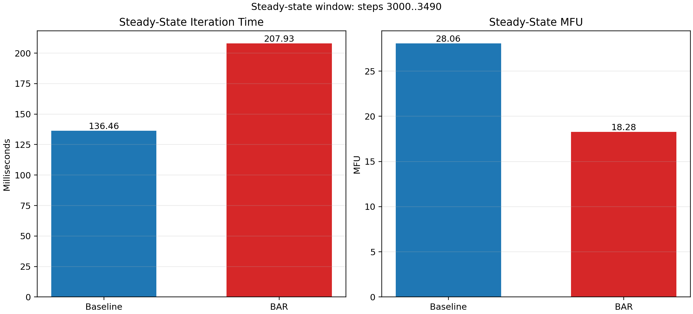

# nanoGPT x Attention Residual

> 基于 `nanoGPT` 复现 Kimi / Moonshot AI 提出的 **Attention Residual** 机制，并在轻量级 GPT 训练框架中完成从模型实现、训练配置到对比实验的全流程验证。

## 项目概述

本项目的目标，是在 **尽可能小而清晰的代码框架** 上实现一项较新的 Transformer 架构改进：**Attention Residual / Block Attention Residuals (BAR)**。

相比直接在大型训练框架中堆叠复杂工程，本仓库选择以 `nanoGPT` 为基础，只对核心建模路径做必要扩展，从而回答两个更有研究价值的问题：

1. **Kimi 风格的 Attention Residual 能否在轻量级 GPT 框架中被忠实实现？**
2. **这种深度维度的残差聚合机制，是否会带来更快的收敛速度或更好的验证表现？**

这使得本项目同时具备两种属性：

- 它是一个 **研究复现项目**，关注机制是否被忠实实现、是否真的学到有效策略。
- 它也是一个 **工程实验项目**，强调在轻量级代码框架里完成可复现、可分析、可扩展的实验闭环。

## 项目目的

传统 Transformer 残差连接通常采用固定加法形式：

$$
h_l = h_{l-1} + f_{l-1}(h_{l-1})
$$

或者在模块级别写作：

$$
y = x + \mathrm{Attn}(x), \quad y = x + \mathrm{MLP}(x)
$$

这种残差路径简单、稳定、易于训练，但也有明显局限：

- **所有历史表示都以固定权重累加**，无法根据输入内容动态选择更重要的深层或浅层信息。
- **深度方向的信息混合是“被动的”**，不同层只能接收已经压缩过的一份状态。
- **随着层数增加，表示可能被持续稀释**，不利于保留早期层或关键中间层的贡献。

Attention Residual 的核心思想，是把“深度方向的固定残差累加”改成“深度方向的注意力聚合”。在本项目中，BAR 的直观形式可以写成：

$$
\tilde{h}_l = \sum_i \alpha_{i \rightarrow l} v_i
$$

其中权重由伪查询向量与候选 residual states 计算得到：

$$
\alpha_{i \rightarrow l} = \mathrm{softmax}\left(w_l^\top \mathrm{RMSNorm}(v_i)\right)
$$

在 Block 版本中，候选集合不再是所有层输出，而是：

$$
V_l = \{b_0, b_1, \dots, b_{n-1}, b_n^i\}
$$

其中：

- $b_0$ 表示 token embedding
- $b_1 \dots b_{n-1}$ 表示历史完整 block 表示
- $b_n^i$ 表示当前 block 内的 partial block

本项目关注的不是“是否把新模块塞进模型里”，而是：

- 这种机制是否能在 `nanoGPT` 上被 **最小侵入式实现**
- 它是否能带来 **更快的训练收敛**
- 它是否为 **长文本建模 / 深度信息利用** 提供更好的结构基础

## 技术亮点

- 在 `nanoGPT` 上实现 **Kimi 风格 Block Attention Residuals**
- 保留 **Baseline / BAR / FAR** 三条路径，便于做公平对照
- 适配 **GPT-2 124M** 规模与 `OpenWebText` 数据集训练配置
- 输出可直接用于比较的 **TensorBoard 日志与 checkpoint**
- 将模型实现、实验设计与结果分析组织成可持续扩展的研究工程

## 项目架构

### 训练与评估流程



### 目录结构

```text
.
├── 2603.15031v1.pdf                  # 论文原文
├── model.py                          # GPT 主体与 BAR/FAR 实现
├── train.py                          # 训练入口
├── sample.py                         # 采样入口
├── config/
│   ├── train_gpt2_124m_pilot.py      # GPT-2 124M 基础训练配置
│   ├── train_shakespeare_char.py     # baseline 最小验证配置
│   ├── train_shakespeare_char_bar.py # BAR 最小验证配置
│   └── train_shakespeare_char_far.py # FAR 最小验证配置
├── data/
│   ├── openwebtext/prepare.py        # OWT 数据下载与预处理
│   └── shakespeare_char/prepare.py   # 小数据集快速验证
├── out-gpt2-124m-3500-baseline/      # baseline 3500 step 输出
├── out-gpt2-124m-3500-bar/           # BAR 3500 step 输出
├── run.md                            # 常用命令整理
├── runowt.md                         # OWT 3500 step 对照实验说明
└── docs/project_showcase_zh.md       # 更完整的技术说明与结果解读
```

### `model.py` 的核心改动

本项目对 `model.py` 的修改重点，不在于改变 token-time 的 causal self-attention 机制本身，而在于 **重写 residual path 的深度聚合逻辑**。

关键设计包括：

1. **新增 `RMSNorm`**
   用于对候选 residual states 做归一化，避免大幅值表示在深度注意力中天然占优。

2. **新增 `BlockAttnRes`**
   用一个轻量级的伪查询向量 `w_l` 对历史 block states 与当前 partial block 做深度维 softmax 聚合。

3. **在 `Block` 中引入双聚合器**
   在每个 Transformer block 内，分别在：
   - attention 子层之前
   - MLP 子层之前
   执行一次 residual aggregation

4. **维护 `blocks + partial_block` 两类状态**
   - `blocks`：已完成的历史 block 表示
   - `partial_block`：当前 block 内逐步构建的中间 residual state

5. **在 `GPT.forward()` 末尾补上 final output aggregation**
   按论文定义，最终输出层需要再聚合全部 block representations，而不是直接把最后一个 `partial_block` 送入 `ln_f`。

6. **保留原始 baseline 路径**
   保证对照实验公平，且不破坏 `nanoGPT` 原有使用方式。

## 我的工作

我在这个项目中完成了以下工作：

- 在 `nanoGPT` 框架中实现 **Kimi 风格 Attention Residual / Block Attention Residuals**
- 设计并落地 `RMSNorm + pseudo-query + blockwise residual aggregation` 的最小实现
- 在 `model.py` 中完成 BAR / FAR / Baseline 三条路径的统一组织
- 修正 BAR 输出阶段的 **final output aggregation**，使实现与论文定义保持一致
- 适配 **GPT-2 124M** 规模的训练配置与 `OpenWebText` 数据集
- 完成从 **数据预处理 -> 训练配置 -> 对比实验 -> TensorBoard 曲线检查** 的完整实验流程
- 保留实验产物目录与日志结构，便于复现实验和后续继续补充结果

## Quick Start

### 1. 安装依赖

```bash
python -m pip install torch numpy transformers datasets tiktoken tqdm tensorboard matplotlib
```

### 2. 准备 OpenWebText 数据

```bash
python data/openwebtext/prepare.py
```

生成完成后可以检查：

```bash
ls -lh data/openwebtext/train.bin data/openwebtext/val.bin
```

说明：

- `OpenWebText` 预处理体积较大，建议预留 `80GB+` 磁盘空间
- 如果只想先验证代码路径是否可运行，建议先使用 Shakespeare 小数据集配置做 smoke test

### 3. 运行 baseline（3500 step）

```bash
python train.py config/train_gpt2_124m_pilot.py \
  --out_dir=out-gpt2-124m-3500-baseline \
  --tensorboard_run_name=gpt2-124m-3500-baseline \
  --wandb_run_name=gpt2-124m-3500-baseline \
  --max_iters=3500 \
  --lr_decay_iters=3500 \
  --seed=1337
```

### 4. 运行 BAR（3500 step）

```bash
python train.py config/train_gpt2_124m_pilot.py \
  --out_dir=out-gpt2-124m-3500-bar \
  --tensorboard_run_name=gpt2-124m-3500-bar \
  --wandb_run_name=gpt2-124m-3500-bar \
  --max_iters=3500 \
  --lr_decay_iters=3500 \
  --seed=1337 \
  --use_block_attention_residuals=True \
  --attn_res_num_blocks=3 \
  --attn_res_use_rmsnorm=True
```

### 5. 启动 TensorBoard 查看对比曲线

```bash
tensorboard \
  --logdir_spec baseline:out-gpt2-124m-3500-baseline/tensorboard/gpt2-124m-3500-baseline,bar:out-gpt2-124m-3500-bar/tensorboard/gpt2-124m-3500-bar \
  --port 6006
```

建议重点观察以下标量：

- `train/loss`
- `eval/train_loss`
- `eval/val_loss`
- `eval/best_val_loss`
- `perf/iter_ms`
- `perf/mfu`

### 6. 可选：快速 smoke test

如果你只想快速验证 BAR 路径是否可运行，可以先执行：

```bash
python data/shakespeare_char/prepare.py

python train.py config/train_shakespeare_char_bar.py \
  --device=cpu \
  --compile=False \
  --eval_iters=20 \
  --log_interval=1 \
  --seed=1337
```

## 实验设置

当前对照实验使用以下统一设置：

| 项目 | 配置 |
| --- | --- |
| 数据集 | `openwebtext` |
| 模型规模 | GPT-2 124M (`12 x 12 x 768`) |
| 上下文长度 | `block_size = 512` |
| micro-batch | `batch_size = 4` |
| 梯度累积 | `gradient_accumulation_steps = 8` |
| 训练步数 | `3500` |
| baseline 输出目录 | `out-gpt2-124m-3500-baseline` |
| BAR 输出目录 | `out-gpt2-124m-3500-bar` |

## 3500 Step 对照结果

当前仓库已经保留两组完整的 3500 step 训练输出：

- `out-gpt2-124m-3500-baseline`
- `out-gpt2-124m-3500-bar`

为了避免依赖已删除的 `analyze_bar.py` / `bar_analysis` 产物，这里的结果分析只基于 TensorBoard event 中的标量：

- `eval/train_loss`
- `eval/val_loss`
- `eval/best_val_loss`
- `perf/iter_ms`
- `perf/mfu`

对应图像与摘要数据可通过以下命令重新导出：

```bash
python scripts/export_owt_result_figures.py \
  --baseline_dir out-gpt2-124m-3500-baseline \
  --bar_dir out-gpt2-124m-3500-bar \
  --output_dir assets/showcase/owt_3500
```

### 1. 训练与验证曲线



从 `eval/train_loss` 与 `eval/val_loss` 的对照可以看到，BAR 在当前 3500 step 预算内整体保持领先。尤其是在验证集上，BAR 的优势在早期阶段开始显现，并在整个可见训练区间内保持为正。

### 2. 验证集差距曲线



上图中曲线定义为：

$$
\Delta_{\mathrm{val}} = \mathrm{ValLoss}_{\mathrm{baseline}} - \mathrm{ValLoss}_{\mathrm{BAR}}
$$

因此，**正值表示 BAR 更好**。当前实验中：

- 峰值验证优势出现在 `step 1800`
- 峰值优势约为 `0.1305`
- 到 `step 3500` 时，BAR 仍保持约 `0.1063` 的验证集优势

这意味着在当前训练预算下，BAR 的收益并不只是早期优化噪声，而是持续保留到了训练结束。

### 3. 效率代价



效率图使用 steady-state 窗口 `step 3000..3490` 的中位数统计，以避免最终 `step 3500` 因 checkpoint / eval 带来的尖峰干扰。结果显示，BAR 相比 baseline 带来了更慢的迭代速度和更低的 MFU，因此其收益需要与训练成本一起判断。

### 4. 关键数值摘要

| 指标 | Baseline | BAR | 结论 |
| --- | --- | --- | --- |
| `eval/train_loss @ 3500` | `4.4604` | `4.3626` | BAR 更低 |
| `eval/val_loss @ 3500` | `4.3978` | `4.2915` | BAR 更低 |
| `best val loss` | `4.3978` | `4.2915` | BAR 更优 |
| `peak validation advantage` | `-` | `0.1305` | BAR 峰值优势明显 |
| `peak advantage step` | `-` | `1800` | 中期达到峰值 |
| `steady-state iter_ms` | `136.46` | `207.93` | BAR 更慢 |
| `steady-state mfu` | `28.06` | `18.28` | BAR 更低 |

### 5. 结果解读

这组结果可以从三个层面来理解：

1. **收敛**
   在当前 `3500` step 预算内，BAR 的 `eval/train_loss` 与 `eval/val_loss` 都优于 baseline，说明这种 block-wise residual aggregation 在当前设置下确实改善了优化过程。

2. **泛化**
   验证集优势的峰值出现在 `step 1800`，但到训练结束时优势仍然保持为正，且没有出现 baseline 在后期持续反超的拐点。这说明当前实验更接近“稳定增益”，而不是一次短暂的早期收益。

3. **代价**
   BAR 并不是“免费收益”。从 steady-state 效率看，它引入了更高的 `iter_ms` 和更低的 `mfu`。因此更合理的结论不是简单地说 BAR 更好，而是：**BAR 在当前训练预算内带来了更低的损失，但也伴随着显著的训练效率成本。**

### 6. 当前分析的边界

这部分图像和结论**只基于 TensorBoard event 标量**，还不包含 BAR 内部权重、历史占比、残差动力学等机制级分析。后续如果补回训练期 residual diagnostics 或专门的分析脚本，可以继续增加：

- residual history share 曲线
- aggregation weight norm 曲线
- 深层 hidden norm 演化
- 不同 `attn_res_num_blocks` 的机制对照

## 项目价值

这个项目的价值不只是“在 `nanoGPT` 上加了一个新模块”，更在于它把一个较新的架构思想拆成了可验证的技术问题：

- **建模能力**：能读论文并把新机制落到实际代码里
- **工程能力**：能在小框架中做最小侵入扩展，而不是重写一整套系统
- **实验能力**：能搭建 baseline vs BAR 的可复现对照实验
- **调试能力**：能检查实现是否与论文机制一致，并修正关键路径问题
- **研究组织能力**：能把模型、代码、实验和结论组织成可持续推进的研究流程

## 研究展望

当前仓库已经完成了 BAR 在轻量级 GPT 框架中的实现与初步对照实验，但从研究角度看，后续仍有几条非常值得继续推进的方向。

### 1. 更长训练区间下的稳定性验证

当前 `3500` step 对照主要回答的是早期与中期收敛问题，但还不足以说明：

- BAR 的优势是否会在更长训练区间内持续存在
- BAR 是否只在优化早期受益，随后被 baseline 追平
- 早期优势能否转化为最终验证集收益

因此，最直接的下一步是把同一套 baseline / BAR 对照延长到更长 horizon，并统计：

- 最优验证损失
- 曲线交叉点
- 早期优势持续区间
- 最终训练与验证 gap

### 2. 分组粒度对机制效果的影响

BAR 的核心超参数之一是 `attn_res_num_blocks`。它直接决定：

- 每个 block 包含多少层
- 历史候选 residual states 的粒度
- 聚合器看到的是更细的层级信息，还是更粗的 block 级摘要

后续应系统比较不同 `attn_res_num_blocks` 设置下的：

- 收敛速度
- 验证集表现
- 训练稳定性
- 额外计算开销

### 3. RMSNorm 与聚合器设计的消融

当前实现采用了论文一致的 `RMSNorm + pseudo-query` 路径，但还有一些关键问题值得继续验证：

- 如果去掉 `RMSNorm`，训练是否更不稳定
- 聚合器是否会偏向高幅值表示
- 不同初始化策略是否影响早期训练动态
- attention 前聚合与 MLP 前聚合各自贡献多大

这类消融有助于区分“BAR 的收益来自核心机制”还是“来自某些实现细节”。


### 4. 长文本感知能力的专门验证

当前 README 里的对照实验，更多反映的是 **训练收敛与验证 loss**。如果要更严谨地支持“长文本感知能力提升”这一方向，后续需要加入更直接的评估：

- 更长上下文长度下的训练或微调
- 长依赖任务上的表现差异
- 长上下文采样质量对比
- 不同上下文长度下 BAR 的收益是否稳定

这部分将把项目从“结构复现 + 收敛观察”进一步推进到“能力验证 + 机制解释”。

## 参考资料

- [Attention Residuals 论文 PDF](2603.15031v1.pdf)
- [OWT 3500 step 对照实验说明](runowt.md)
- [训练命令整理](run.md)
- [深度说明文档](docs/project_showcase_zh.md)

---

如果你关注 **Transformer 架构改进、残差路径设计、轻量级训练框架复现** 或 **面向研究的工程实验组织**，这个项目可以作为一个继续扩展和深入分析的基础起点。
