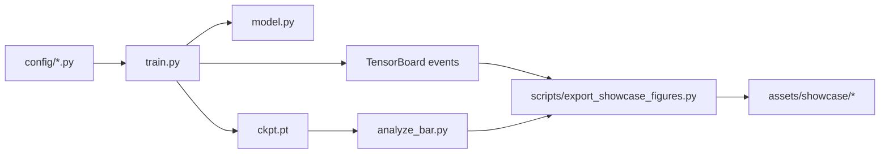
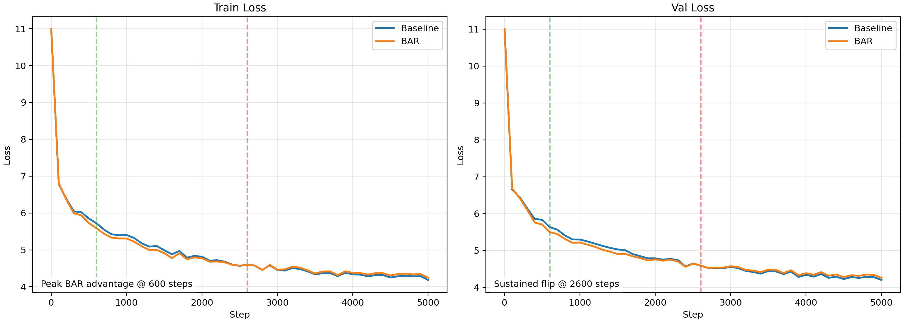
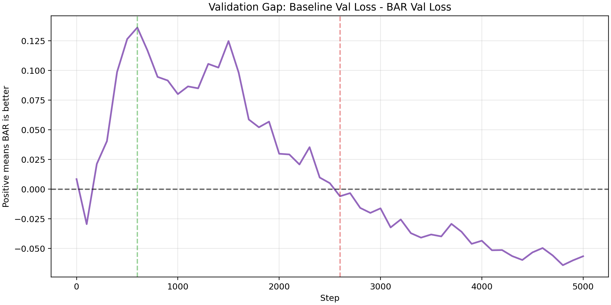
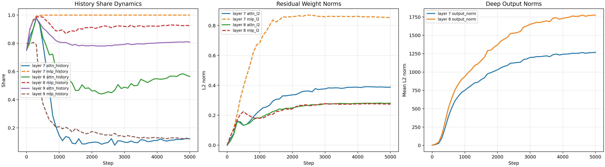
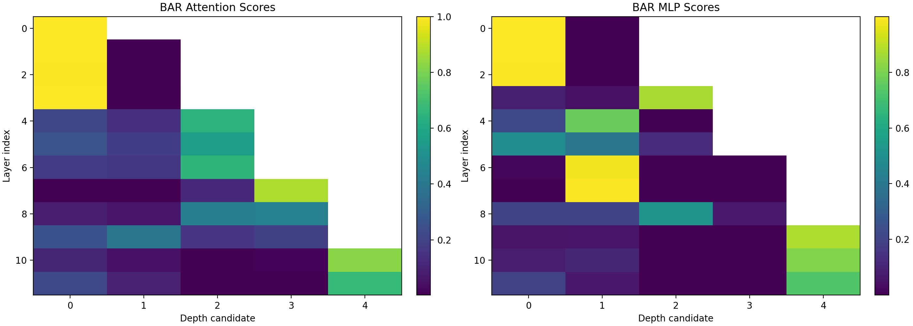

# nanoGPT x Kimi-Style Block Attention Residuals

基于 `nanoGPT` 的 Kimi-style residual attention 研究复现与分析项目。

这个仓库不只是把一个新模块塞进 GPT，而是围绕一个更具体的问题展开：当我们在 residual path 上引入深度聚合器后，它到底有没有学到有效策略，这种策略能否稳定转化为更好的训练与验证表现，以及要继续把它做成可信研究，还需要补哪些证据。

当前仓库已经形成了完整的研究闭环：

- 在 [`model.py`](model.py) 中实现 baseline、BAR、FAR 三条路径。
- 在 [`train.py`](train.py) 中加入训练期 residual diagnostics 和 TensorBoard 记录。
- 在 [`analyze_bar.py`](analyze_bar.py) 中统一完成 checkpoint 分析与消融对比。
- 在 [`scripts/export_showcase_figures.py`](scripts/export_showcase_figures.py) 中把曲线、热图和 JSON 摘要导出为稳定展示资产。

补充阅读：

- 深度说明见 [`docs/project_showcase_zh.md`](docs/project_showcase_zh.md)
- 运行命令见 [`run.md`](run.md)
- 代码结构说明见 [`code_structure_zh.md`](code_structure_zh.md)

## 项目概述

本项目的核心是在尽量保持 `nanoGPT` 简洁风格的前提下，研究一种面向深度维度的 residual aggregation 机制。

和标准 GPT 不同，这里的改动不发生在 token 时间维的 causal self-attention，而是发生在 block 之间的 residual path 上。模型会在若干候选 residual states 之间学习一个深度方向的加权策略，再把聚合结果送入 attention/MLP 子层。

项目目前支持三种模式：

| 模式 | 含义 | 作用 |
| --- | --- | --- |
| Baseline | 原始 `nanoGPT` 残差路径 | 对照组 |
| BAR | Block Attention Residuals | 主研究对象 |
| FAR | Full Attention Residuals | 扩展控制组 |

## 项目目标

本项目当前阶段的目标不是直接宣称“提出了一个更好的 GPT”，而是把下面几件事做扎实：

1. 在最小 GPT 框架中落地 BAR/FAR，而不破坏 `nanoGPT` 的可读性与配置风格。
2. 让 residual aggregation 变成可观测机制，而不是训练后只能看最终 loss 的黑盒模块。
3. 用低成本调试轨道和中等规模 pilot 轨道拆开回答两个问题：
   - 机制是否真的学到了非平凡策略；
   - 这种策略是否能够稳定转化为最终验证收益。
4. 产出可直接用于 GitHub 展示、项目汇报和后续复现实验的稳定结果资产。

## 核心实现与研究链路



关键文件职责如下：

| 文件 | 作用 |
| --- | --- |
| `model.py` | 实现 `RMSNorm`、`BlockAttnRes`、BAR/FAR 路径和 `return_bar_stats=True` 的辅助统计 |
| `train.py` | 训练入口，负责 TensorBoard、residual stats 和 checkpoint 保存 |
| `analyze_bar.py` | 统一分析 baseline/BAR/FAR，并支持 `learned / uniform / current_only` 消融 |
| `scripts/export_showcase_figures.py` | 从事件文件和分析产物导出可稳定引用的图表和 JSON 摘要 |
| `config/*.py` | 管理 baseline、BAR、FAR 与 pilot 训练配置 |

## 实验设置

本项目目前主要包含两条实验轨道。

### 1. 机制调试轨道：Shakespeare Char

用途：

- 验证 BAR/FAR 路径是否能稳定训练。
- 验证 residual stats 日志是否完整。
- 验证 `analyze_bar.py` 与展示导出脚本是否工作正常。

对应配置：

- [`config/train_shakespeare_char.py`](config/train_shakespeare_char.py)
- [`config/train_shakespeare_char_bar.py`](config/train_shakespeare_char_bar.py)
- [`config/train_shakespeare_char_far.py`](config/train_shakespeare_char_far.py)

### 2. 主展示轨道：OpenWebText 124M Pilot

当前 README 展示的主结果来自 `OpenWebText` 上的 GPT-2 124M 量级 pilot，对照组分别为 baseline 与 BAR。

| 项目 | 设置 |
| --- | --- |
| 数据集 | `openwebtext` |
| 模型规模 | GPT-2 124M 量级，`n_layer=12`，`n_head=12`，`n_embd=768` |
| 上下文长度 | `block_size=512` |
| micro-batch | `batch_size=4` |
| 梯度累积 | `gradient_accumulation_steps=8` |
| 日志方式 | TensorBoard + JSON 摘要 |
| 当前公开快照 | 展示资产覆盖到 `5000` step |
| 结果目录 | `out-gpt2-124m-pilot-baseline`、`out-gpt2-124m-pilot-bar` |

当前 README 中的数值主要来自：

- [`assets/showcase/metrics_summary.json`](assets/showcase/metrics_summary.json)
- [`assets/showcase/diagnosis_summary.json`](assets/showcase/diagnosis_summary.json)
- [`assets/showcase/loss_mode_comparison.json`](assets/showcase/loss_mode_comparison.json)

## 实验结果

### 1. 训练/验证曲线





关键时间点如下：

| Step | Baseline Train | BAR Train | Baseline Val | BAR Val | `Baseline Val - BAR Val` |
| --- | --- | --- | --- | --- | --- |
| 600 | `5.7235` | `5.5875` | `5.6338` | `5.4975` | `+0.1362` |
| 1000 | `5.4025` | `5.3089` | `5.2975` | `5.2174` | `+0.0801` |
| 2600 | `4.6015` | `4.5936` | `4.5893` | `4.5952` | `-0.0059` |
| 5000 | `4.1836` | `4.2442` | `4.2024` | `4.2589` | `-0.0565` |

可以直接读出三点：

1. BAR 在训练早期确实有更快的下降趋势。
2. 这种优势在约 `2600` step 附近发生翻转。
3. 到当前 `5000` step 快照，最终验证损失仍由 baseline 略优。

### 2. 机制消融结果

基于已有 BAR 分析快照，使用 `learned / uniform / current_only` 三种模式得到：

| 模式 | Mean Loss | 相对 `learned` 的变化 |
| --- | --- | --- |
| `learned` | `4.3302` | `0.0000` |
| `uniform` | `10.0288` | `+5.6986` |
| `current_only` | `16.2412` | `+11.9110` |

这说明聚合器并没有退化成“随便混一混”：

- 如果把候选 residual states 均匀平均，loss 会显著恶化。
- 如果只保留当前状态、不利用历史状态，loss 会进一步恶化。
- 也就是说，BAR 学到的是一个真实影响模型行为的聚合策略，而不是一个训练后无效的装饰性模块。

### 3. 残差动力学证据





当前诊断摘要给出的关键指标为：

| 指标 | 数值 |
| --- | --- |
| `mean_normalized_entropy` | `0.4509` |
| `mean_current_share` | `0.4893` |
| `mean_history_share` | `0.5107` |
| `max_l2_norm` | `0.9253` |

这组数据说明：

- 聚合分布不是接近 1 的高熵均匀分配。
- 聚合也没有塌缩为只看当前层。
- 历史状态与当前状态被接近均衡地使用，但这种均衡不是平均主义，而是学习得到的非平凡分配。

## 结果分析

这是当前项目最重要的部分。

### 1. BAR 的问题不是“机制没学到”，而是“收益没稳定兑现”

如果只看最终 `5000` step 的验证损失，很容易得出一个过于简单的结论：BAR 没有优于 baseline。

但把训练曲线和消融分析放在一起后，结论会更精确：

- BAR 早期确实带来了优化优势。
- BAR 的聚合器也确实学到了有效策略。
- 真正未被解决的问题，是这份机制优势为什么没有稳定转化为中后期的泛化优势。

这比“有效”或“无效”的二元判断更接近真实研究状态。当前结果支持的不是一条产品结论，而是一条研究结论：

> BAR 在当前 `nanoGPT` 实现中已经学到了非平凡的历史残差聚合策略，并在 OpenWebText 124M pilot 的早期阶段表现出验证损失优势；但截至当前 `5000` step 快照，这项优势尚未稳定保持，最终验证损失仍由 baseline 略优。

### 2. 这组结果揭示了一个值得继续研究的“优化-泛化解耦”现象

当前结果最有价值的地方，不是证明 BAR 已经赢了，而是暴露出一个具体而可研究的问题：

- 机制层面，BAR 是活的；
- 优化早期，BAR 是有帮助的；
- 泛化终局，BAR 还没有稳定占优。

这意味着我们面对的不是“模块是否存在价值”的问题，而是“什么条件下，这种价值能稳定保留下来”的问题。

从研究角度看，这比单纯获得一个更低的 final val loss 更值得继续追。

### 3. 当前结果引申出的重点研究问题

1. 训练长度是否不足以让 BAR 的早期优势重新兑现  
   当前展示快照只覆盖到 `5000` step，而 pilot 配置本身允许更长训练。下一步应优先验证 BAR 是“后期掉队”，还是“需要更长 horizon 才能兑现收益”。

2. 学习率调度与聚合器更新速度是否不匹配  
   BAR 早期收益明显，后期却被 baseline 反超，说明聚合器可能在训练后段过度干预或更新节奏与 backbone 不匹配。值得测试更保守的学习率、warmup、更强约束，或对聚合器使用单独调度。

3. 深度分组粒度是否影响中后期稳定性  
   当前分析元数据表明 pilot 中 `attn_res_num_blocks=4`，而每组层数会直接决定候选 residual states 的组合方式。下一步适合系统比较不同分组粒度对早期优势和后期稳定性的影响。

4. BAR 学到的“有效策略”是否过于依赖单次 seed 和单次训练轨道  
   当前结果来自单次 pilot 快照，尚不足以说明趋势稳定。必须做多 seed，对“早期优势是否稳定出现”“翻转步数是否稳定”进行统计。

5. FAR 与 BAR 的差异是否能帮助判断问题出在 block 级聚合还是 residual attention 思路本身  
   当前 FAR 已经有实现，但展示证据还不完整。把 FAR 纳入同粒度对比后，才能更清楚地区分“BAR 特有问题”和“更广义 residual attention 的共性问题”。

### 4. 为什么这些分析比单个最终数字更重要

一个最终 loss 只能回答“这次跑完谁更低”，但不能回答下面这些更像研究的问题：

- 模块是不是活着。
- 模块到底在利用什么信息。
- 早期优势为什么会消失。
- 下一轮实验该优先改哪里。

本项目最大的价值，恰恰是把这些问题通过训练日志、分析脚本和结构化 JSON 暴露出来，而不是把实验停留在“跑完一条曲线”的层面。

## 研究过程

本项目的推进过程大致分为五步：

1. 以原始 `nanoGPT` 为基线，保留标准训练入口和 baseline 路径。
2. 在 [`model.py`](model.py) 中以最小侵入方式加入 `BlockAttnRes`、`RMSNorm`、BAR/FAR 路径和辅助统计接口。
3. 在 [`train.py`](train.py) 中加入 TensorBoard 与 residual stats 记录，让机制行为在训练过程中可观测。
4. 在 [`analyze_bar.py`](analyze_bar.py) 中统一输出权重摘要、热图、hidden norms、loss mode comparison 和诊断结论。
5. 用 [`scripts/export_showcase_figures.py`](scripts/export_showcase_figures.py) 把事件文件和分析快照整理为 [`assets/showcase`](assets/showcase) 下的稳定展示资产，再回写 README 与展示文档。

这种流程的意义在于：它把“建模改动”“训练结果”“机制解释”“项目展示”连成了一条完整链路，后续补实验时不需要重新搭脚手架。

## 后续展望和不足

### 后续展望

1. 把 OpenWebText pilot 延长到更长训练区间，验证 BAR 的早期优势是否能重新出现或稳定保持。
2. 做多 seed 对照，统计 peak advantage、flip step 和最终 val gap 的方差。
3. 系统比较不同 `attn_res_num_blocks`、不同 RMSNorm/非 RMSNorm 组合、不同学习率策略。
4. 补齐 FAR 的展示材料，形成 baseline/BAR/FAR 的三路完整对照。
5. 在 loss 之外增加采样质量、吞吐、显存占用等工程指标，使研究结论更完整。

### 当前不足

1. 当前公开结果仍然是单次 pilot 快照，证据强度有限。
2. README 主结论基于 `5000` step 展示区间，尚不能代表更长训练后的最终趋势。
3. FAR 虽已实现，但当前没有和 BAR 同粒度的展示证据。
4. 仓库内两个 `ckpt.pt` 当前在本地 `torch.load` 时会报 zip archive 读取错误，因此现阶段更可靠的对外证据来源是 `assets/showcase/*.json`、`assets/showcase/*.png` 与 `bar_analysis/*`，而不是直接把 checkpoint 当作可发布复现实验资产。

## 快速开始

### 安装依赖

```bash
python -m pip install torch numpy transformers datasets tiktoken tqdm tensorboard matplotlib
```

### Shakespeare 小规模验证

```bash
python data/shakespeare_char/prepare.py
python train.py config/train_shakespeare_char.py --seed=1337 --residual_stats_log=True
python train.py config/train_shakespeare_char_bar.py --seed=1337 --residual_stats_log=True
python analyze_bar.py --out_dir=out-shakespeare-char-bar --dataset=shakespeare_char --split=val --num_batches=4 --batch_size=8
```

### 导出展示资产

```bash
python scripts/export_showcase_figures.py \
  --baseline_dir out-gpt2-124m-pilot-baseline \
  --bar_dir out-gpt2-124m-pilot-bar \
  --bar_analysis_dir out-gpt2-124m-pilot-bar/bar_analysis \
  --output_dir assets/showcase
```

更多命令见 [`run.md`](run.md)。
