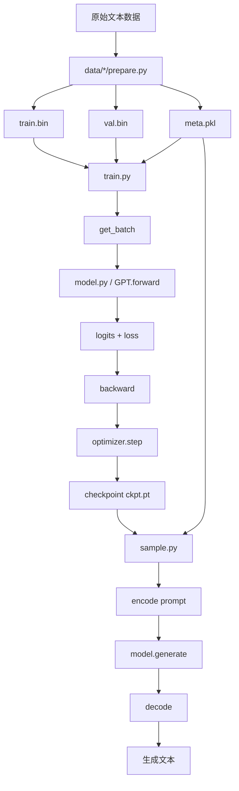
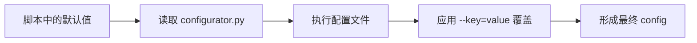
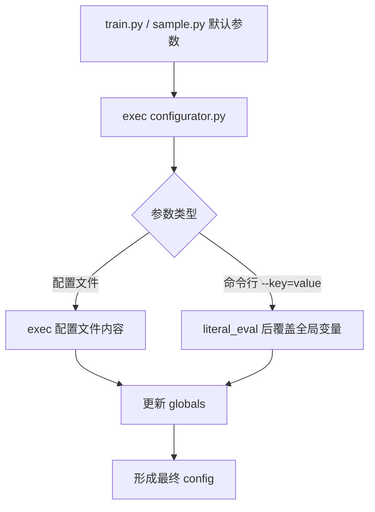
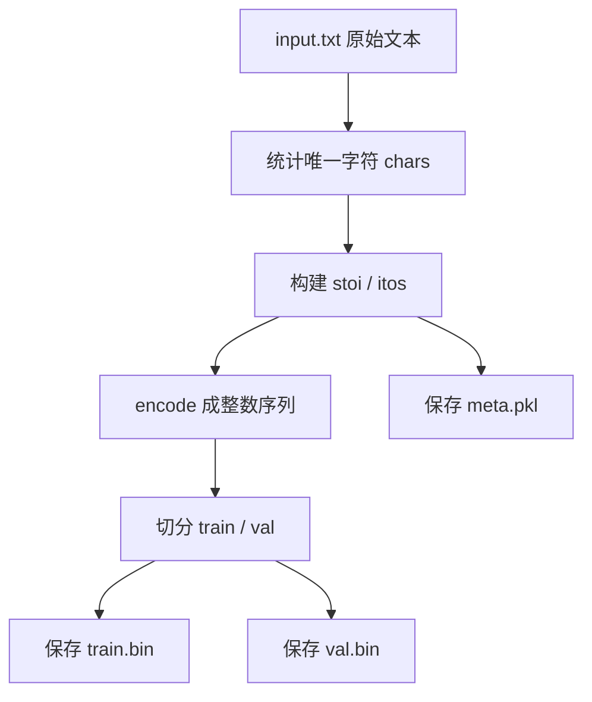
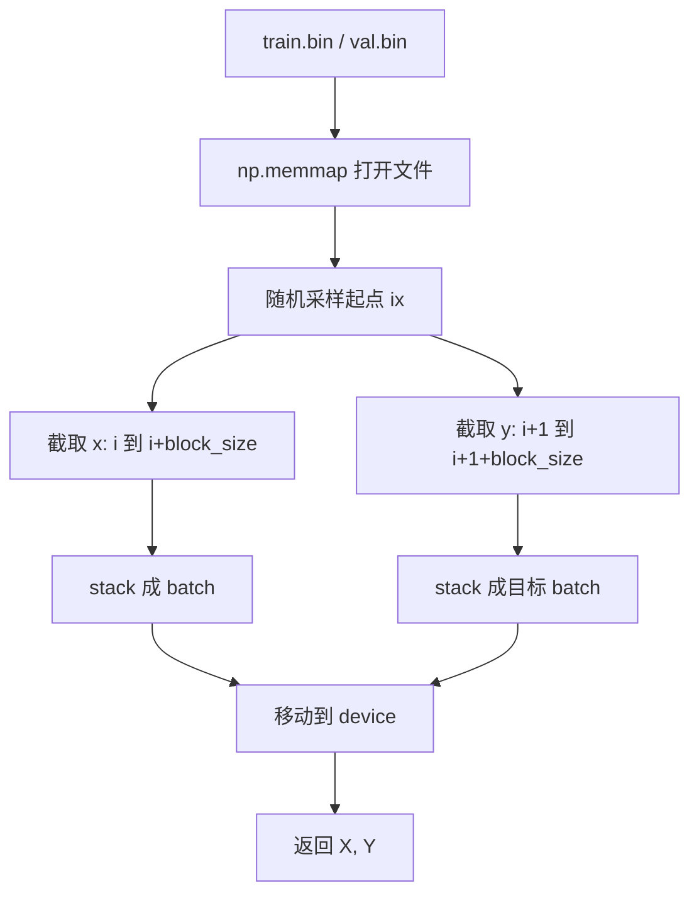
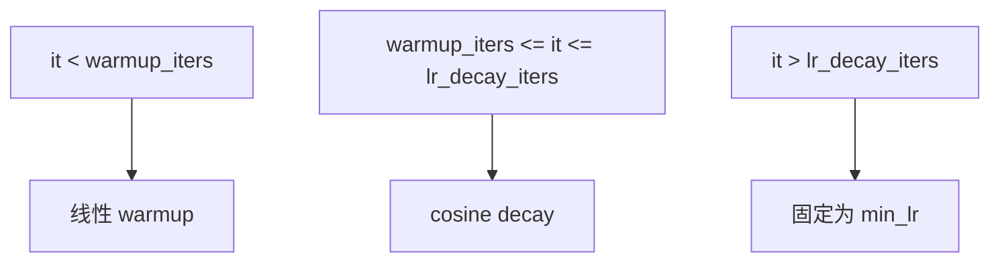
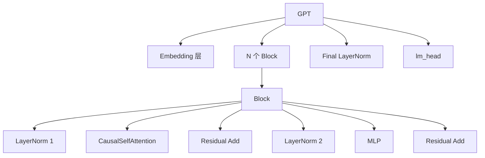
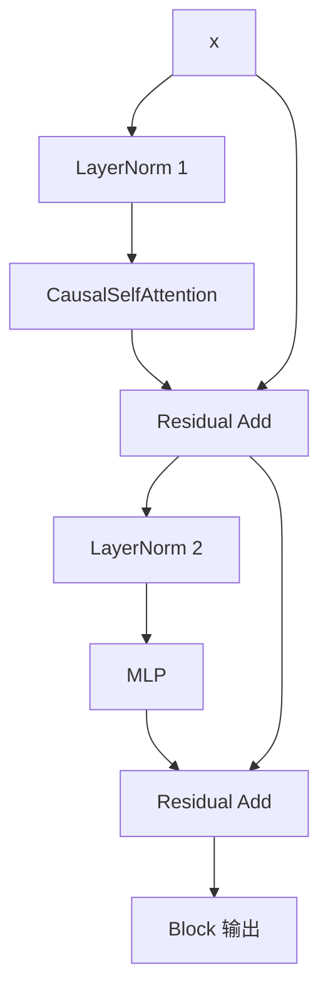
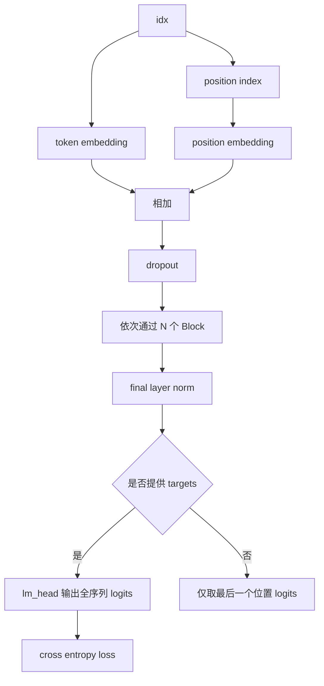

# nanoGPT 代码结构拆解

这份文档从“整个项目如何运行”出发，拆解 `nanoGPT` 的目录结构、关键文件职责，以及训练、采样、配置和模型内部的数据流。

适合两类场景：

1. 第一次读这个仓库，想先建立全局图景。
2. 面试或复习时，需要快速回忆“代码是怎么串起来的”。

## 1. 项目一句话概述

`nanoGPT` 是一个尽量精简但闭环完整的 GPT 训练仓库：

- 数据预处理脚本把文本转成 token id 序列
- `train.py` 负责训练主循环
- `model.py` 定义 GPT 模型
- `sample.py` 负责加载模型并生成文本
- `configurator.py` 负责用配置文件和命令行覆盖默认参数

它不是一个大而全的平台，而是一个非常适合理解 GPT 训练主干逻辑的最小实现。

## 2. 顶层目录结构

```text
nanoGPT/
├── README.md
├── model.py
├── train.py
├── sample.py
├── bench.py
├── configurator.py
├── config/
│   ├── train_shakespeare_char.py
│   ├── train_gpt2.py
│   ├── finetune_shakespeare.py
│   └── eval_gpt2*.py
├── data/
│   ├── shakespeare_char/
│   │   ├── prepare.py
│   │   └── readme.md
│   ├── shakespeare/
│   │   ├── prepare.py
│   │   └── readme.md
│   └── openwebtext/
│       ├── prepare.py
│       └── readme.md
├── assets/
├── transformer_sizing.ipynb
└── scaling_laws.ipynb
```

## 3. 文件职责总览

| 文件/目录 | 作用 | 你读它时应该重点关注什么 |
| --- | --- | --- |
| `README.md` | 项目说明和启动方式 | 先知道项目解决什么问题、有哪些典型运行路径 |
| `train.py` | 训练主入口 | 配置、数据取样、模型初始化、训练循环、checkpoint |
| `model.py` | GPT 模型定义 | Attention、MLP、Block、GPT.forward、generate |
| `sample.py` | 推理/采样脚本 | checkpoint 加载、prompt 编码、循环生成 |
| `bench.py` | 性能基准脚本 | 一个精简版训练循环，用来测速度 |
| `configurator.py` | 配置覆盖器 | 配置文件和命令行参数如何注入脚本 |
| `config/` | 训练和评估配置样例 | 不同实验场景下覆盖哪些默认参数 |
| `data/*/prepare.py` | 数据预处理脚本 | 原始文本如何变成 `train.bin`、`val.bin`、`meta.pkl` |
| `*.ipynb` | 辅助分析 | 不是主流程的一部分，偏实验和估算 |

## 4. 整个项目的主执行链路

先记住这条最重要的主线：

```text
原始文本
-> prepare.py 预处理
-> train.bin / val.bin / meta.pkl
-> train.py 取 batch
-> model.py 前向传播
-> loss
-> backward + optimizer.step
-> ckpt.pt
-> sample.py 加载模型并生成文本
```

### 全局流程图



## 5. 代码阅读顺序建议

如果你第一次拆这个仓库，推荐按这个顺序读：

1. `README.md`
2. `config/train_shakespeare_char.py`
3. `train.py`
4. `model.py`
5. `sample.py`
6. `data/shakespeare_char/prepare.py`
7. `bench.py`

这个顺序的好处是：

- 先知道“怎么跑”
- 再知道“训练主循环怎么组织”
- 然后再进入“模型内部怎么计算”

## 6. 配置系统怎么工作

这个项目的配置风格很特别：它不是用复杂配置框架，而是直接 `exec(open('configurator.py').read())`。

### 配置来源有三层

1. 脚本内默认参数
2. 配置文件，例如 `config/train_shakespeare_char.py`
3. 命令行参数，例如 `--batch_size=32`

### 配置覆盖顺序



### 具体工作方式

在 `train.py` 和 `sample.py` 里，会先定义一组默认变量，例如：

- `batch_size`
- `block_size`
- `n_layer`
- `n_head`
- `n_embd`
- `device`
- `compile`

随后执行 `configurator.py`：

1. 如果命令行参数里有不带 `=` 的内容，就把它当配置文件路径。
2. 如果参数形如 `--key=value`，就覆盖同名全局变量。
3. 最后整理出 `config` 字典，用于 logging 和 checkpoint 保存。

### 配置流转图



## 7. 数据预处理流程

### 7.1 字符级数据路径

`data/shakespeare_char/prepare.py` 是最适合入门的版本。

它做的事情很直接：

1. 下载 `tinyshakespeare` 文本
2. 收集所有唯一字符
3. 建立 `stoi` 和 `itos`
4. 把全文映射成整数序列
5. 切成 train/val
6. 保存成：
   - `train.bin`
   - `val.bin`
   - `meta.pkl`

### 字符级数据流程图



### 7.2 OpenWebText 路径

`data/openwebtext/prepare.py` 是更接近正式 GPT-2 训练的路径。

它的主要区别是：

1. 使用 `datasets` 下载 OpenWebText
2. 用 `tiktoken` 的 GPT-2 BPE tokenizer 编码
3. 每条样本末尾附加 `eot_token`
4. 把所有 token 拼接成超长的一维 token 流
5. 保存为 `uint16` 的 `train.bin` 和 `val.bin`

### 为什么是 `.bin`

因为训练时不需要保留一条条原始样本结构，而是把所有 token 看成一条超长序列，训练时从中随机截取长度为 `block_size` 的子序列。

## 8. `train.py` 训练主流程拆解

`train.py` 是整个项目的调度中心。

你可以把它拆成 8 个阶段。

### 8.1 阶段一：定义默认超参数

这里定义了：

- 输出目录
- eval/log 频率
- 数据集名
- batch size 和 block size
- 模型规模
- 学习率、weight decay、betas
- dtype、device、compile

这一段的作用是给脚本一个“默认能跑”的起点。

### 8.2 阶段二：配置注入

通过 `configurator.py` 把配置文件和命令行参数覆盖进来。

此时脚本才拿到这次实验真正的参数。

### 8.3 阶段三：设备/DDP 初始化

这里判断当前是否处于 DDP 模式。

如果是 DDP：

- 初始化进程组
- 读取 `RANK`、`LOCAL_RANK`、`WORLD_SIZE`
- 设置当前进程使用的 GPU
- 重新调整 `gradient_accumulation_steps`

如果不是 DDP：

- 当作单进程训练

### 8.4 阶段四：构建数据读取函数 `get_batch`

这是训练数据进入模型的关键入口。

它的逻辑是：

1. 根据 `split` 选择 `train.bin` 或 `val.bin`
2. 用 `np.memmap` 打开数据
3. 随机采样若干起点位置 `ix`
4. 对每个起点截取：
   - `x = data[i : i + block_size]`
   - `y = data[i + 1 : i + 1 + block_size]`
5. 转成 tensor
6. 放到目标设备上

这里的本质是：

- `x` 是上下文
- `y` 是右移一位后的监督目标

### `get_batch` 流程图



### 8.5 阶段五：初始化模型

这里支持三种路径：

1. `init_from = 'scratch'`
2. `init_from = 'resume'`
3. `init_from = 'gpt2*'`

#### `scratch`

- 从 `GPTConfig` 新建模型
- 优先从 `meta.pkl` 读取 `vocab_size`

#### `resume`

- 从 `out_dir/ckpt.pt` 读取 checkpoint
- 恢复模型参数
- 恢复 `iter_num` 和 `best_val_loss`
- 恢复 optimizer 状态

#### `gpt2*`

- 从 Hugging Face 的 GPT-2 权重初始化
- 把模型结构参数同步回 `model_args`

### 8.6 阶段六：构建 optimizer、scaler、compile、DDP 包装

顺序大致是：

1. 创建 GradScaler
2. 调用 `model.configure_optimizers()`
3. 如果是 `resume`，恢复 optimizer
4. 如果 `compile=True`，执行 `torch.compile`
5. 如果是 DDP，外包一层 `DDP(model)`

### 8.7 阶段七：定义辅助函数

`estimate_loss()`

- 在 train/val 上各抽 `eval_iters` 个 batch
- 估计平均 loss

`get_lr(it)`

- 先 warmup
- 再 cosine decay
- 最终降到 `min_lr`

### 学习率调度图



### 8.8 阶段八：进入主训练循环

主循环里每一轮迭代做这些事：

1. 计算当前学习率
2. 定期 eval，并可能保存 checkpoint
3. 做 `gradient_accumulation_steps` 次 micro-step
4. 每次 micro-step：
   - forward
   - 计算 loss
   - 按累积步数缩放 loss
   - 预取下一个 batch
   - backward
5. 梯度裁剪
6. optimizer step
7. scaler update
8. 清空梯度
9. 打印日志
10. 增加 `iter_num`
11. 判断是否结束训练

### 训练主循环流程图

```mermaid
flowchart TD
    A[开始训练] --> B[设置当前 lr]
    B --> C{是否到 eval_interval}
    C -->|是| D[estimate_loss]
    D --> E[记录 train/val loss]
    E --> F[按条件保存 checkpoint]
    C -->|否| G[进入 micro-step 循环]
    F --> G

    G --> H[model(X, Y)]
    H --> I[得到 logits, loss]
    I --> J[loss 除以 gradient_accumulation_steps]
    J --> K[预取下一批 X, Y]
    K --> L[backward]
    L --> M{micro-step 是否结束}
    M -->|否| G
    M -->|是| N[clip grad]
    N --> O[optimizer.step]
    O --> P[scaler.update]
    P --> Q[optimizer.zero_grad]
    Q --> R[打印日志]
    R --> S[iter_num += 1]
    S --> T{是否超过 max_iters}
    T -->|否| B
    T -->|是| U[结束训练]
```

## 9. `model.py` 模型内部拆解

`model.py` 是这个仓库的核心。

它定义了整个 GPT 的层次结构。

## 9.1 模块组成

从小到大依次是：

1. `LayerNorm`
2. `CausalSelfAttention`
3. `MLP`
4. `Block`
5. `GPTConfig`
6. `GPT`

### 模型层次图



### 9.2 `CausalSelfAttention`

这是“模型如何看上下文”的核心。

它的流程是：

1. 输入 `x` 经过一个线性层，拆成 `q`、`k`、`v`
2. 把多头维度拆出来
3. 计算 attention score
4. 加 causal mask，禁止看到未来位置
5. softmax 得到注意力分布
6. 用注意力权重加权汇总 `v`
7. 经过输出投影和 dropout

### Attention 内部流程图

```mermaid
flowchart TD
    A[x] --> B[c_attn 线性投影]
    B --> C[拆成 q, k, v]
    C --> D[reshape 为多头]
    D --> E[计算 q @ k^T / sqrt(d)]
    E --> F[加 causal mask]
    F --> G[softmax]
    G --> H[attention dropout]
    H --> I[与 v 相乘]
    I --> J[拼回所有头]
    J --> K[c_proj]
    K --> L[resid dropout]
    L --> M[attention 输出]
```

### 9.3 `MLP`

MLP 的逻辑是：

1. 先升维到 `4 * n_embd`
2. 做 `GELU`
3. 再投影回 `n_embd`
4. dropout

作用可以理解为：

- attention 负责 token 间交互
- MLP 负责单位置上的非线性变换

### 9.4 `Block`

一个 `Block` 由两段残差组成：

1. `x = x + attn(ln_1(x))`
2. `x = x + mlp(ln_2(x))`

这说明它采用的是 **Pre-LN Transformer Block**。

### Block 流程图



### 9.5 `GPT.forward`

这是训练时最重要的函数。

它的流程是：

1. 输入 `idx`
2. 查 token embedding
3. 查 position embedding
4. 两者相加后做 dropout
5. 依次通过所有 `Block`
6. 做最终 LayerNorm
7. 如果有 `targets`：
   - 计算全序列 logits
   - 计算交叉熵 loss
8. 如果没有 `targets`：
   - 只取最后一个位置的 logits

### `GPT.forward` 流程图



### 9.6 `generate`

`generate()` 是推理时的循环生成逻辑。

它每一步都做：

1. 如果上下文太长，只保留最后 `block_size` 个 token
2. 调用模型 forward
3. 取最后一个位置 logits
4. 除以 `temperature`
5. 可选 `top_k` 截断
6. softmax 得概率
7. 采样一个新 token
8. 拼接回序列

### 生成流程图

```mermaid
flowchart TD
    A[当前序列 idx] --> B[裁剪到 block_size]
    B --> C[self(idx_cond)]
    C --> D[取最后位置 logits]
    D --> E[temperature 缩放]
    E --> F[top_k 截断 可选]
    F --> G[softmax]
    G --> H[采样下一个 token]
    H --> I[拼接到 idx]
    I --> J{是否达到 max_new_tokens}
    J -->|否| A
    J -->|是| K[返回完整序列]
```

## 10. `sample.py` 推理脚本拆解

`sample.py` 的逻辑可以分成 5 步：

1. 读取配置
2. 加载模型
3. 加载编码器/解码器
4. 编码 prompt
5. 调用 `generate()` 并输出文本

### 它支持两种模型来源

1. `init_from = 'resume'`
   - 从训练输出目录里的 `ckpt.pt` 恢复
2. `init_from = 'gpt2*'`
   - 直接加载 OpenAI GPT-2 权重

### `sample.py` 流程图

```mermaid
flowchart TD
    A[启动 sample.py] --> B[读默认参数和 configurator]
    B --> C{init_from}
    C -->|resume| D[加载 ckpt.pt]
    C -->|gpt2*| E[加载预训练 GPT-2]
    D --> F[构建 GPTConfig]
    F --> G[恢复 state_dict]
    E --> H[得到 model]
    G --> I[model.eval + to(device)]
    H --> I
    I --> J{是否存在 meta.pkl}
    J -->|是| K[使用 stoi / itos 编码解码]
    J -->|否| L[使用 GPT-2 tokenizer]
    K --> M[编码 start prompt]
    L --> M
    M --> N[调用 model.generate]
    N --> O[decode]
    O --> P[打印生成文本]
```

## 11. `bench.py` 在项目里的位置

`bench.py` 不是训练主入口，而是一个更短的性能测试脚本。

它保留了下面几件事：

1. 构造 batch
2. 构造模型
3. forward + backward + optimizer.step
4. 统计时间和 MFU

所以它可以理解为：

- `train.py` 的“去业务化、去 checkpoint 化、去 eval 化”的最小 benchmark 版

## 12. 配置文件的角色

`config/` 目录不是新脚本，而是“覆盖 train.py 默认参数”的配置片段。

### 常见配置文件

`config/train_shakespeare_char.py`

- 最小可运行实验
- 小模型
- 小数据
- 适合调试和入门

`config/train_gpt2.py`

- OpenWebText + GPT-2 124M 训练配置
- 目标是更严肃的大训练

`config/finetune_shakespeare.py`

- 从预训练 GPT-2 初始化，再在 Shakespeare 上继续训练

`config/eval_gpt2*.py`

- 用于评估 GPT-2 不同规模模型

## 13. 项目中的几条“代码主线”

你可以把整个仓库拆成下面 5 条主线。

### 主线一：数据主线

```text
prepare.py -> train.bin / val.bin / meta.pkl -> get_batch()
```

### 主线二：配置主线

```text
脚本默认参数 -> 配置文件 -> 命令行覆盖 -> 最终 config
```

### 主线三：模型主线

```text
Embedding -> Block x N -> LayerNorm -> lm_head -> logits / loss
```

### 主线四：训练主线

```text
取 batch -> forward -> loss -> backward -> clip -> step -> log -> save checkpoint
```

### 主线五：推理主线

```text
加载 checkpoint -> encode prompt -> generate -> decode -> 输出文本
```

## 14. 面试或复习时最值得讲的 10 个点

1. 这是一个“最小但完整”的 GPT 训练闭环。
2. 数据最终被压成一维 token 流，而不是保留样本边界。
3. `get_batch()` 通过随机切片构造自回归监督。
4. `x` 和 `y` 的关系是“右移一位的 next-token prediction”。
5. `Block` 是 Pre-LN 结构。
6. attention 负责 token 间交互，MLP 负责位置内变换。
7. 训练时计算全序列 logits，推理时只取最后一个位置 logits。
8. `configurator.py` 用最简单的方式统一配置覆盖。
9. checkpoint 不只保存模型，也保存 optimizer 和 config。
10. `bench.py` 是性能验证的旁路，不是主训练流程。

## 15. 一页总结

如果只能记住最重要的内容，请记住这四句话：

1. `train.py` 是总调度器，负责把数据、模型、优化器和训练循环串起来。
2. `model.py` 是核心计算图，定义了 GPT 的 Attention、MLP、Block 和生成逻辑。
3. `configurator.py` 负责把默认参数、配置文件和命令行参数合并成最终实验设置。
4. 整个项目的本质闭环是：`prepare -> train -> checkpoint -> sample`。
