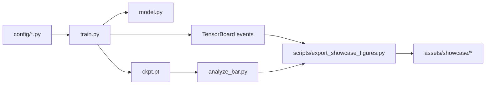
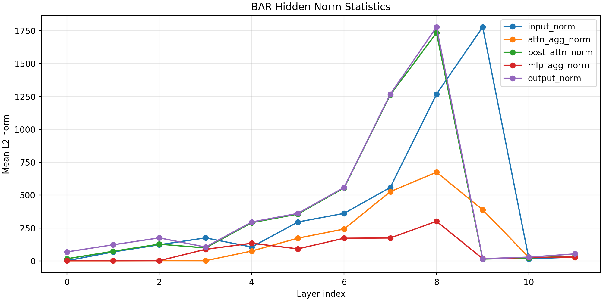

# nanoGPT x Kimi-Style Block Attention Residuals 深度分析

这份文档承接根目录 `README.md` 未展开的部分，目标不是重复首页摘要，而是把项目的研究问题、工程组织、实验设置、结果证据和风险边界讲清楚，便于：

- 作为 GitHub 项目的深度说明文档。
- 作为面试官或技术评审的补充阅读材料。
- 作为后续继续补图、补实验时的稳定结构骨架。

[返回首页 README](../README.md) | [展示指标快照](../assets/showcase/metrics_summary.json) | [训练与分析命令](../run.md)

## 1. 项目定位

本项目的定位是：

> 基于 `nanoGPT` 的 Kimi-style residual attention 研究工程复现与分析项目。

这个定位有两层含义：

1. 它首先是一个研究复现项目，关注的是机制是否有效，而不是只做工程封装。
2. 它同时是一个工程展示项目，要求结果图、指标、目录结构和说明文档能够直接面向 GitHub 与面试场景。

因此，项目交付不只包含模型改动，还包含：

- 训练时的机制日志。
- 统一的 checkpoint / event 分析脚本。
- 稳定的图像导出与指标快照。
- 面向非仓库作者阅读的项目叙事。

## 2. 核心研究问题

当前阶段聚焦三个问题：

### 2.1 深度残差聚合是否能在最小 GPT 框架里落地

这里的关键不是“把一个新模块塞进去”，而是：

- 不破坏 `nanoGPT` 的原始入口和配置风格。
- 不把训练代码变成难以阅读的大型框架。
- 保留 baseline、BAR、FAR 三种路径的可比性。

### 2.2 聚合器是否真的学到了非平凡策略

如果 BAR 只是参数上存在、行为上退化，那么它的价值很低。为此，本项目专门加入了：

- `learned / uniform / current_only` 消融。
- attention/MLP 两条 residual aggregation 路径的统计。
- 历史占比、当前占比、熵和权重范数的追踪。

### 2.3 训练收益是否稳定

即便机制有效，也不等于最终 loss 会稳定更低。当前结果的重点在于把这两件事拆开讨论：

- “机制学到了什么”。
- “最终结果是否更好”。

## 3. 机制设计概览

### 3.1 Baseline、BAR、FAR 的关系

当前仓库支持三条主要路径：

| 路径 | 含义 | 当前定位 |
| --- | --- | --- |
| Baseline | 原始 `nanoGPT` residual 路径 | 对照组 |
| BAR | Block Attention Residuals | 主研究对象 |
| FAR | Full Attention Residuals | 扩展控制组 |

### 3.2 BAR 在本项目中的实现思路

本项目没有替换原始 token-time causal self-attention，而是在 residual path 上增加深度聚合器。

可以把 BAR 的核心公式直观写成：

```text
h_mix = sum_i alpha_i * h_i
alpha = softmax(w^T * Norm(h_i))
```

其中：

- `h_i` 是候选 residual states。
- 候选集合包含历史 block 状态和当前 partial block。
- `alpha` 在深度维度上归一化，而不是在 token 时间维度上归一化。

### 3.3 为什么要同时保留 BAR 和 FAR

保留 FAR 的意义不在于首页主推 FAR，而在于：

- 说明模型改动不是一次性 hardcode。
- 让 residual attention 的设计空间有一个更完整的对照面。
- 为后续补实验留下自然扩展点。

## 4. 代码改动如何落到仓库里

### 4.1 `model.py`

`model.py` 是本项目最核心的改动位置：

- 增加 `RMSNorm` 与 `BlockAttnRes`。
- 在 `Block` 中增加 BAR/FAR 的 residual aggregation 路径。
- 在 `GPT.forward()` 中支持返回 `return_bar_stats=True` 的辅助统计。

这部分改动的工程原则是“最小侵入”：

- 仍然保留原始 baseline 路径。
- 不改变训练入口的基本用法。
- 让分析逻辑可以通过统一的辅助返回值获取。

### 4.2 `train.py`

`train.py` 的增强主要体现在诊断层：

- 增加 TensorBoard 日志。
- 增加 residual stats 采样逻辑。
- 记录 history share、entropy、weight norm 等机制指标。

这一步非常关键，因为如果没有训练期诊断，后续分析只能依赖最终 checkpoint，而无法观察机制在训练过程中如何变化。

### 4.3 `analyze_bar.py`

`analyze_bar.py` 的作用是把“能跑分析”和“能解释结果”连接起来：

- 同时支持 baseline、BAR、FAR。
- 支持 `learned / uniform / current_only` 三种模式。
- 导出 weight summary、heatmap、hidden norms、loss 对比和诊断摘要。

### 4.4 `scripts/export_showcase_figures.py`

这个脚本是项目展示层的关键补丁，它做了两件事：

- 从 TensorBoard 事件里抽取 baseline vs BAR 的训练/验证曲线与 residual dynamics。
- 从 `bar_analysis` 目录中复制稳定的分析图和诊断快照。

因此，README 不需要依赖手工截图，也不需要现场打开 TensorBoard。

## 5. 项目 Pipeline 与代码结构

### 5.1 实验 Pipeline



### 5.2 代码结构视图

| 文件 | 角色 | 对展示能力的意义 |
| --- | --- | --- |
| `model.py` | 实现 BAR/FAR 机制 | 体现建模实现能力 |
| `train.py` | 训练与诊断入口 | 体现训练工程组织能力 |
| `analyze_bar.py` | 分析与消融入口 | 体现研究方法设计能力 |
| `scripts/export_showcase_figures.py` | 展示图稳定导出 | 体现结果产品化能力 |
| `config/*.py` | baseline / BAR / FAR 配置 | 体现实验可复用性 |

## 6. 实验设置

### 6.1 首页主结果使用的实验轨道

当前首页主结果来自 OpenWebText 124M pilot：

| 项目 | 当前信息 |
| --- | --- |
| 数据集 | `openwebtext` |
| 模型规模 | GPT-2 124M 量级 |
| 上下文长度 | `block_size = 512` |
| micro-batch | `batch_size = 4` |
| 梯度累积 | `gradient_accumulation_steps = 8` |
| 当前展示区间 | 导出快照覆盖到 `5000` step |
| 结果目录 | `out-gpt2-124m-pilot-baseline`、`out-gpt2-124m-pilot-bar` |

### 6.2 机制调试轨道

Shakespeare char 轨道主要用于低成本验证：

- BAR/FAR 路径能否正常训练。
- residual stats 日志是否完整。
- 分析脚本是否能产出预期图像和 JSON。

对应配置包括：

- `config/train_shakespeare_char.py`
- `config/train_shakespeare_char_bar.py`
- `config/train_shakespeare_char_far.py`

### 6.3 推荐命令

主命令入口可参考 [`run.md`](../run.md)，这里仅保留最关键的一组：

```bash
python train.py config/train_shakespeare_char.py --seed=1337 --residual_stats_log=True
python train.py config/train_shakespeare_char_bar.py --seed=1337 --residual_stats_log=True
python train.py config/train_shakespeare_char_far.py --seed=1337 --residual_stats_log=True
```

```bash
python analyze_bar.py \
  --out_dir=out-shakespeare-char-bar \
  --dataset=shakespeare_char \
  --split=val \
  --num_batches=4 \
  --batch_size=8
```

```bash
python scripts/export_showcase_figures.py \
  --baseline_dir out-gpt2-124m-pilot-baseline \
  --bar_dir out-gpt2-124m-pilot-bar \
  --bar_analysis_dir out-gpt2-124m-pilot-bar/bar_analysis \
  --output_dir assets/showcase
```

## 7. 结果解读

### 7.1 训练表现


当前首页使用的训练表现快照来自 `assets/showcase/metrics_summary.json`，其中最重要的时间点如下：

| Step | Baseline Train | BAR Train | Baseline Val | BAR Val | Val Gap |
| --- | --- | --- | --- | --- | --- |
| 600 | `5.7235` | `5.5875` | `5.6338` | `5.4975` | `+0.1362` |
| 1000 | `5.4025` | `5.3089` | `5.2975` | `5.2174` | `+0.0801` |
| 2600 | `4.6015` | `4.5936` | `4.5893` | `4.5952` | `-0.0059` |
| 5000 | `4.1836` | `4.2442` | `4.2024` | `4.2589` | `-0.0565` |

这组时间点的意义很清楚：

- BAR 早期确实表现出更快的下降趋势。
- 优势在中期附近发生翻转。
- 当前展示区间结束时，baseline 仍略优。


因此，当前最合理的写法不是“BAR 优于 baseline”，而是：

> BAR 在当前 pilot 中表现出早期优化优势，但这项优势尚未稳定转化为最终验证收益。

### 7.2 机制是否真的生效

训练表现之外，最关键的机制证据来自 `diagnosis_summary.json` 与 `loss_mode_comparison.json`。

| 模式 | Mean Loss | 解释 |
| --- | --- | --- |
| `learned` | `4.3302` | 当前训练得到的真实 BAR 聚合器 |
| `uniform` | `10.0288` | 把深度候选均匀混合 |
| `current_only` | `16.2412` | 只保留当前表示，不使用历史状态 |

这个结果非常重要，因为它说明：

- 聚合器已经显著偏离“什么都没学到”的状态。
- 历史状态对当前模型是有效信息，而不是噪声。
- BAR 的主要问题不是“机制失效”，而是“机制收益尚未稳定转化为最终泛化提升”。

### 7.3 残差动力学


当前展示中可用的机制指标包括：

- `mean_normalized_entropy ≈ 0.4509`
- `current_share ≈ 0.4893`
- `history_share ≈ 0.5107`
- `max_l2_norm ≈ 0.9253`

这组指标支持如下判断：

- 聚合不是均匀分配。
- 聚合也没有退化为“只看当前层”。
- 历史与当前之间形成了接近平衡但并不平均的利用关系。

### 7.4 首批样本热图与隐藏状态范数


热图提供的是“某一批样本上的局部视图”，适合展示 BAR 在不同层如何选择候选 residual states。



隐藏状态范数图则更适合作为补充证据，用来观察输入、聚合后和输出状态的相对尺度是否异常。

## 8. 工程能力展示点

如果把这个项目作为工程与研究能力展示材料，最值得强调的不是“加了一个新模块”，而是下面四点：

### 8.1 最小侵入式建模

- 保留 baseline 路径。
- 在 `model.py` 内局部扩展 BAR/FAR。
- 不把训练脚本重写成新的框架。

### 8.2 训练期可观测性

- 不是只保存 checkpoint。
- 在训练过程中就把 residual behavior 写入 TensorBoard。
- 让“机制是否活着”成为可观测量。

### 8.3 统一分析入口

- 用一个分析脚本处理 baseline、BAR、FAR。
- 用统一的 `learned / uniform / current_only` 消融口径解释结果。
- 用诊断摘要把“看图说话”变成结构化结论。

### 8.4 展示资产稳定化

- 用导出脚本把事件文件和分析图整理成稳定路径。
- 让 README 可以引用仓库内正式资产，而不是临时截图。
- 降低后续维护和补图的成本。

## 9. 结果可信度与风险

这一节故意写得更克制，因为它直接决定这份材料是否可信。

### 9.1 当前最可靠的证据来源

当前文档中的数值和图像主要来自：

- `assets/showcase/metrics_summary.json`
- `assets/showcase/diagnosis_summary.json`
- `assets/showcase/loss_mode_comparison.json`
- `assets/showcase/*.png`

它们本质上对应的是：

- OpenWebText pilot 的 TensorBoard 事件。
- `out-gpt2-124m-pilot-bar/bar_analysis` 的分析快照。

### 9.2 当前还不能对外过度承诺的部分

在重新确认 checkpoint 读回与复现实验路径之前，当前材料不做以下承诺：

- 不承诺仓库内 checkpoint 可以作为对外发布的复现实验资产。
- 不承诺 BAR 在更长训练区间一定优于 baseline。
- 不承诺当前单次 pilot 的趋势等价于多 seed 稳定趋势。

### 9.3 当前结论的正确边界

当前最稳妥、最准确的结论是：

> BAR 在当前 `nanoGPT` 实现中已经学到了非平凡的历史残差聚合策略，并在 OpenWebText 124M 短程 pilot 的早期阶段表现出验证损失优势；但截至当前 `5000` step 快照，这项优势尚未稳定保持，最终验证损失仍由 baseline 略优。

## 10. 后续实验路线

当前最值得继续推进的路线有五条：

1. 把 BAR 的 OpenWebText pilot 延长到更长训练区间，确认早期优势是否会在中后期重新出现。
2. 做多 seed 统计，区分趋势与偶然波动。
3. 对 FAR 做和 BAR 同粒度的展示与分析，形成完整三路对比。
4. 增加 sample 质量、吞吐和显存占用等工程指标。
5. 清理与固化 BAR pilot 配置，确保主展示实验的配置文件与产物一一对应。

## 11. 补充阅读

当前仓库还保留了几份更偏源码理解和面试准备的文档，它们不是首页主入口，但适合作为补充材料：

- [`model_explain.md`](../model_explain.md)
- [`code_structure_zh.md`](../code_structure_zh.md)
- [`interview_prep.md`](../interview_prep.md)
- [`train_explarin.md`](../train_explarin.md)

这些文档更适合在已经理解项目主线之后再阅读，而不是直接放在首页并列展开。
